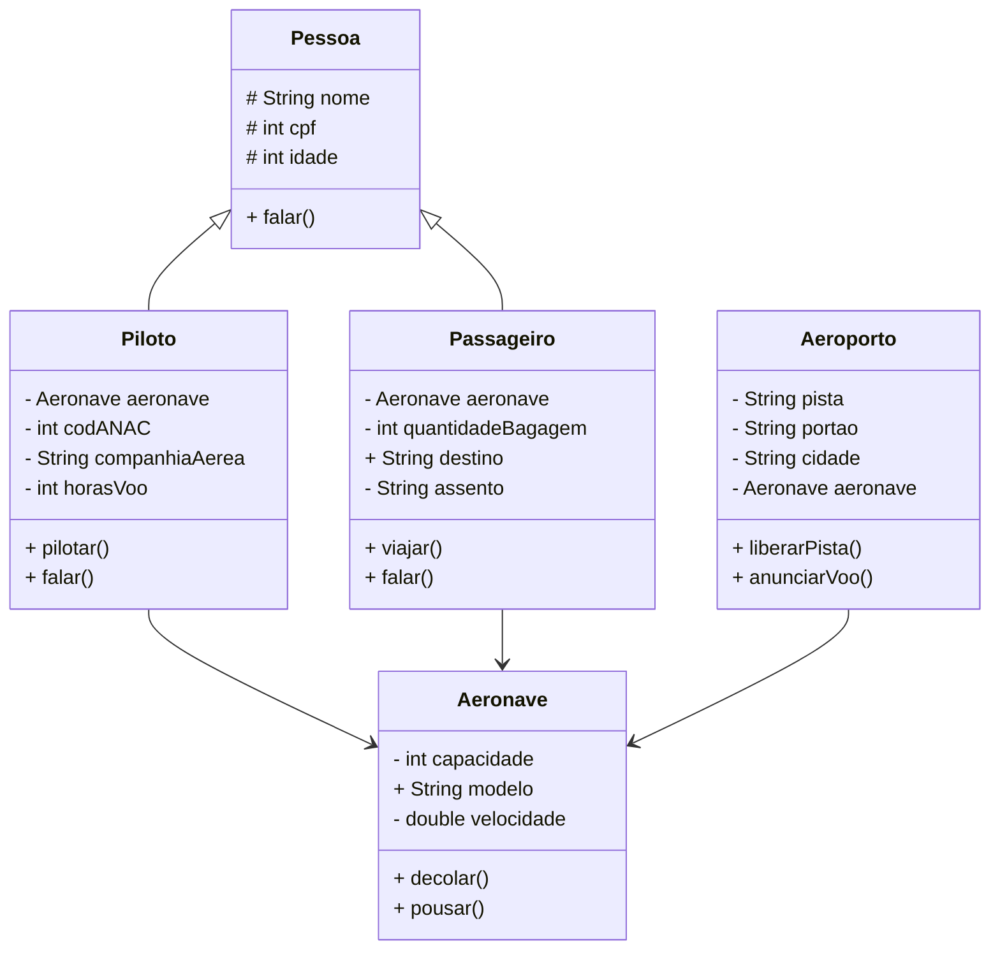

# Diagrama de Classes

```mermaid
classDiagram

class Pessoa {
    # String nome
    # int cpf
    # int idade
    + falar()
}

class Piloto {
    - Aeronave aeronave
    - int codANAC
    - String companhiaAerea
    - int horasVoo
    + pilotar()
    + falar()
}

class Passageiro {
    - Aeronave aeronave
    - int quantidadeBagagem
    + String destino
    - String assento
    + viajar()
    + falar()
}

class Aeronave {
    - int capacidade
    + String modelo
    - double velocidade
    + decolar()
    + pousar()
}

class Aeroporto {
    - String pista
    - String portao
    - String cidade
    - Aeronave aeronave
    + liberarPista()
    + anunciarVoo()
}

Pessoa <|-- Piloto
Pessoa <|-- Passageiro

Piloto --> Aeronave
Passageiro --> Aeronave
Aeroporto --> Aeronave
```