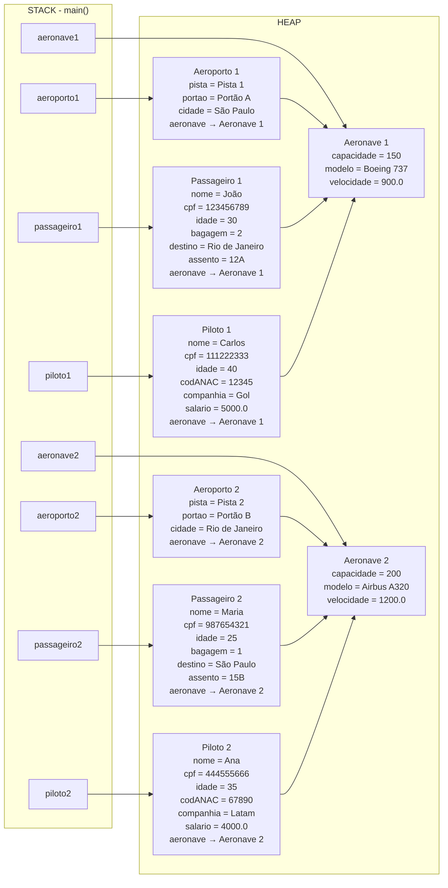

# Diagrama de Memória

```mermaid
flowchart LR

    subgraph STACK["STACK - main()"]
        A1["aeronave1"]
        A2["aeronave2"]
        AP1["aeroporto1"]
        AP2["aeroporto2"]
        P1["passageiro1"]
        P2["passageiro2"]
        PI1["piloto1"]
        PI2["piloto2"]
    end

    subgraph HEAP["HEAP"]
        
        HA1["Aeronave 1<br>capacidade = 150<br>modelo = Boeing 737<br>velocidade = 900.0"]
        
        HA2["Aeronave 2<br>capacidade = 200<br>modelo = Airbus A320<br>velocidade = 1200.0"]

        HAP1["Aeroporto 1<br>pista = Pista 1<br>portao = Portão A<br>cidade = São Paulo<br>aeronave → Aeronave 1"]

        HAP2["Aeroporto 2<br>pista = Pista 2<br>portao = Portão B<br>cidade = Rio de Janeiro<br>aeronave → Aeronave 2"]

        HP1["Passageiro 1<br>nome = João<br>cpf = 123456789<br>idade = 30<br>bagagem = 2<br>destino = Rio de Janeiro<br>assento = 12A<br>aeronave → Aeronave 1"]

        HP2["Passageiro 2<br>nome = Maria<br>cpf = 987654321<br>idade = 25<br>bagagem = 1<br>destino = São Paulo<br>assento = 15B<br>aeronave → Aeronave 2"]

        HPI1["Piloto 1<br>nome = Carlos<br>cpf = 111222333<br>idade = 40<br>codANAC = 12345<br>companhia = Gol<br>salario = 5000.0<br>aeronave → Aeronave 1"]

        HPI2["Piloto 2<br>nome = Ana<br>cpf = 444555666<br>idade = 35<br>codANAC = 67890<br>companhia = Latam<br>salario = 4000.0<br>aeronave → Aeronave 2"]
    end

    A1 --> HA1
    A2 --> HA2

    AP1 --> HAP1
    AP2 --> HAP2

    P1 --> HP1
    P2 --> HP2

    PI1 --> HPI1
    PI2 --> HPI2

    HAP1 --> HA1
    HAP2 --> HA2

    HP1 --> HA1
    HP2 --> HA2

    HPI1 --> HA1
    HPI2 --> HA2
```