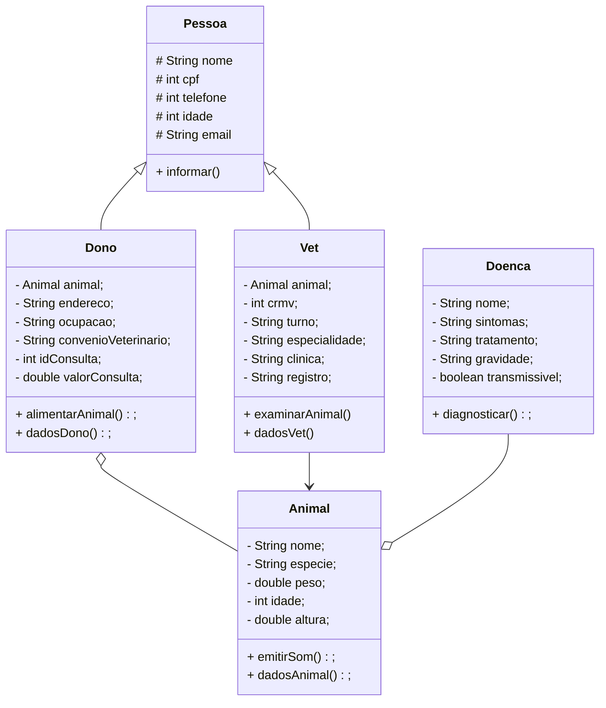

# Diagrama de Classes

```mermaid
classDiagram

class Pessoa {
    # String nome
    # int cpf
    # int telefone
    # int idade
    # String email
    + informar()
}

class Vet {
    - Animal animal;
    - int crmv;
    - String turno;
    - String especialidade;
    - String clinica;
    - String registro;
    + examinarAnimal()
    + dadosVet()
}

class Dono {
    - Animal animal;
    - String endereco;
    - String ocupacao;
    - String convenioVeterinario;
    - int idConsulta;
    - double valorConsulta;
    + alimentarAnimal();
    + dadosDono();
}

class Doenca {
    - String nome;
    - String sintomas;
    - String tratamento;
    - String gravidade;
    - boolean transmissivel;
    + diagnosticar();
}

class Animal {
    - String nome;
    - String especie;
    - double peso;
    - int idade;
    - double altura;
    + emitirSom();
    + dadosAnimal();
}

Pessoa <|-- Vet
Pessoa <|-- Dono

Dono o-- Animal
Vet --> Animal
Doenca --o Animal
```